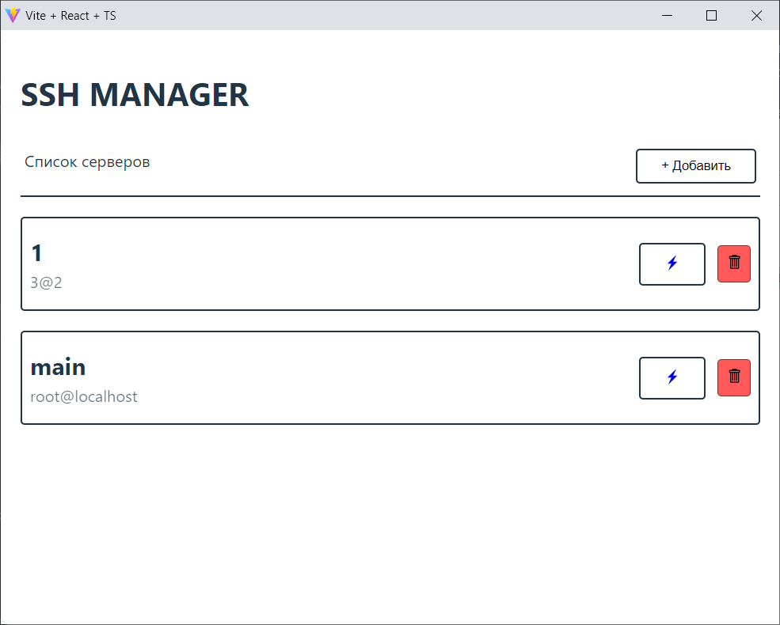

<h1>👩‍💼 SSH MANAGER</h1>

A program for quick connection to your ssh servers without entering a password and confirmations. Enter the address, authorization and work with the server.

[Vite](https://vitejs.dev/), [react](https://github.com/facebook/react), [effector](https://github.com/effector/effector), and [eel](https://github.com/python-eel/Eel) with sqlite3 db are used.
The client is made according to the [fsd2](https://feature-sliced.design/) architecture.



## Usage

Clone this repo or download via [link](https://github.com/merely04/chat-roulette-bot)
```bash
git clone https://github.com/merely04/chat-roulette-bot
```

<details>
<summary>Windows</summary>

- Simple
1. Download .exe from releases
2. Launch ssh-manager.exe

- Hard
1. Download pyton 3.10 or higher
2. Install dependencies
```bash
pip install eel peewee paramiko
```
3. Install nodejs 18.0 or higher and yarn
4. Install dependencies
```bash
yarn install
```
5. Build and start
```bash
yarn build:react
yarn start
```
</details>